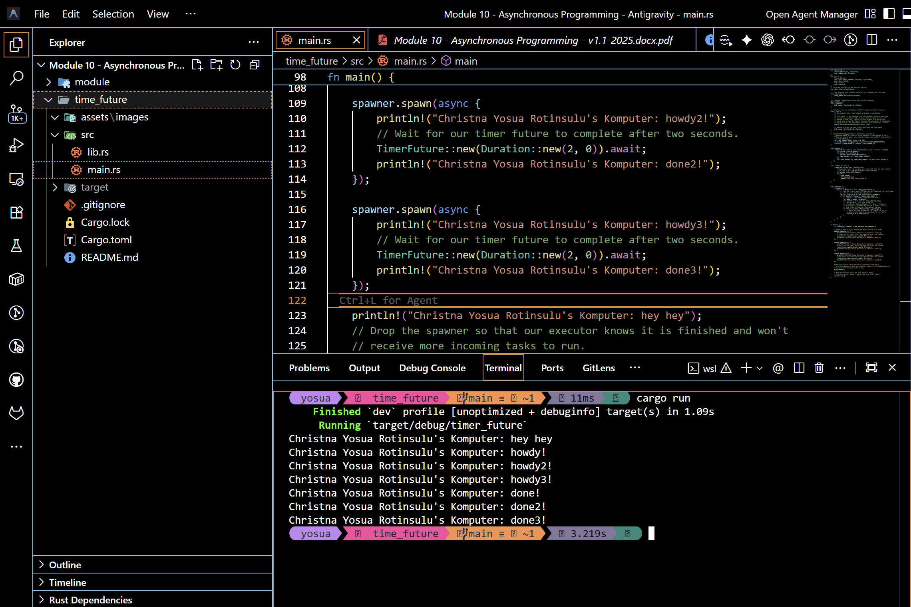
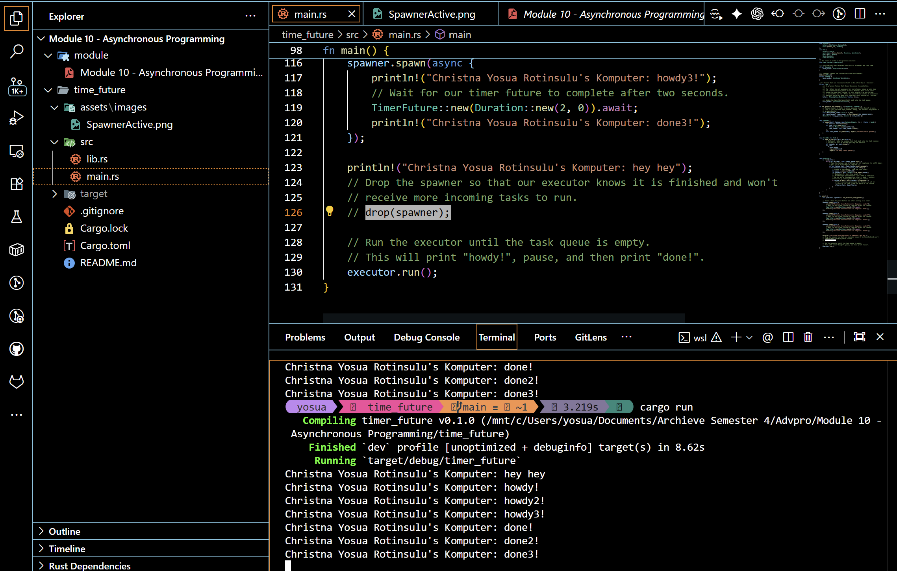

# ⚡ Modul 10: Asynchronous Programming di Rust
### Nama: Christna Yosua Rotinsulu
### NPM: 2406495691
### Kelas: Pemrograman Lanjut - Fasilkom UI

---

## 🧭 Eksperimen 1.2: Memahami Cara Kerja Eksekusi Asinkronus

Pada eksperimen ini, saya mengeksplorasi bagaimana alur eksekusi asinkronus (*asynchronous execution flow*) bekerja di Rust dengan menambahkan baris cetak (`hey hey`) di utas utama (*main thread*) tepat setelah tugas didelegasikan ke Spawner.

### 📸 Hasil Eksekusi Program di Terminal Saya

Berikut adalah cuplikan keluaran ketika saya menjalankan program hasil modifikasi ini menggunakan perintah `cargo run`:

```bash
Christna Yosua Rotinsulu's Komputer: hey hey
Christna Yosua Rotinsulu's Komputer: howdy!
Christna Yosua Rotinsulu's Komputer: done!
```

---

## 🧠 Analisis & Penjelasan Mengapa `"hey hey"` Muncul Pertama

Meskipun baris `println!("... hey hey")` ditulis setelah pemanggilan `spawner.spawn(async { ... })`, teks `"hey hey"` dicetak **paling pertama** di terminal saya. Berikut adalah penjelasan logis mengapa hal ini terjadi:

1. **Sifat `spawner.spawn` yang Bersifat Non-Blocking (Asinkronus)**:
   Saat saya memanggil `spawner.spawn(...)`, blok kode `async` di dalamnya tidak langsung dieksekusi secara instan. Fungsi `spawn` hanya membungkus masa depan (*Future*) tersebut ke dalam bentuk `Task`, lalu mengirimkannya ke dalam antrean tugas (`ready_queue`) melalui pengirim channel asinkronus (`task_sender`). Proses pengiriman tugas ke antrean ini berlangsung sangat cepat dan tidak memblokir utas utama.

2. **Eksekusi Sinkronus pada Utas Utama**:
   Setelah tugas berhasil dimasukkan ke dalam antrean, utas utama (*main thread*) segera melanjutkan eksekusi ke baris berikutnya secara sinkronus. Baris berikutnya adalah `println!("Christna Yosua Rotinsulu's Komputer: hey hey");`. Karena utas utama saat itu bebas dari hambatan, kalimat `"hey hey"` dicetak pertama kali.

3. **Executor Belum Berjalan**:
   Blok `async` yang berisi `"howdy!"` and `"done!"` belum dapat dieksekusi karena mesin penggeraknya, yaitu `executor.run()`, baru dipanggil di bagian paling akhir fungsi `main`. Sebelum `executor.run()` dieksekusi, tidak ada komponen yang memproses atau melakukan polling terhadap antrean tugas tersebut.

4. **Alur Eksekusi di dalam Executor**:
   Setelah `"hey hey"` dicetak dan `drop(spawner)` dipanggil, program akhirnya memanggil `executor.run()`. Di sinilah tugas di dalam antrean mulai dieksekusi:
   - **Tugas Dipolling (Poll Pertama)**: Executor mengambil tugas dari antrean dan memanggil metode `poll()`. Ini memicu pencetakan `"howdy!"`.
   - **Menunggu Timer**: Saat menemui `TimerFuture::new(...).await`, executor mendeteksi bahwa timer asinkronus belum selesai (`Poll::Pending`). Executor secara cerdas melepas tugas ini dan menunggu waker di utas terpisah untuk membangunkannya kembali setelah 2 detik berlalu.
   - **Tugas Dipolling Kembali (Poll Kedua)**: Setelah 2 detik, utas timer memanggil `waker.wake()`, menaruh kembali tugas ke antrean. Executor mendapati statusnya telah selesai (`Poll::Ready`) lalu melanjutkan eksekusi hingga mencetak kata `"done!"`.

---

## ⚙️ Eksperimen 1.3: Simfoni Multiple Spawn dan Efek Penghapusan `drop(spawner)`

Pada bagian ini, saya mengamati efek dari mendaftarkan banyak tugas asinkronus sekaligus (Multiple Spawn) ke dalam antrean tugas, serta menguji peran vital dari pemanggilan `drop(spawner);`.

### 1. Spawning Banyak Tugas (Multiple Spawning) secara Bersamaan

Saya menduplikasi pemanggilan `spawner.spawn(...)` sebanyak 3 kali secara berurutan dengan jeda tidur 2 detik dan pesan log yang berbeda (`howdy!`/`done!`, `howdy2!`/`done2!`, `howdy3!`/`done3!`).

#### 📸 Capture Eksekusi dengan Spawner Aktif (`drop(spawner)` Dijalankan)

Berikut adalah tangkapan layar ketika program dieksekusi dengan 3 tugas spawned dan fungsi `drop(spawner)` diaktifkan secara normal:



#### 🧠 Analisis Hasil Pengamatan:
Ketika program dijalankan, semua pesan `"howdy"`, `"howdy2"`, dan `"howdy3"` dicetak di awal secara berturut-turut tanpa jeda 2 detik. Hal ini karena:
* Tugas asinkronus bersifat **non-blocking**. Begitu tugas pertama menunggu timernya (`Poll::Pending`), ia langsung mengalah dan mengembalikan kendali ke executor.
* Executor langsung memproses tugas kedua dan ketiga di antrean tanpa menunggu tugas pertama selesai.
* Ketiga timer 2 detik berjalan secara paralel di utas latar belakang masing-masing. Oleh karena itu, setelah 2 detik berlalu, ketiga tugas dibangunkan hampir bersamaan dan mencetak pesan `"done"` , `"done2"`, dan `"done3"` secara berturut-turut.
* Setelah semua tugas selesai, program **berhenti dengan bersih** dan kembali ke prompt terminal PowerShell (seperti terlihat pada gambar di atas).

---

### 2. Efek Menghapus / Mengomentari `drop(spawner);`

Selanjutnya, saya menguji apa yang terjadi apabila baris `drop(spawner);` dikomentari atau dihapus dari kode sumber `src/main.rs`.

#### 📸 Capture Eksekusi dengan Spawner Tidak Aktif (`drop(spawner)` Dikomentari)

Berikut adalah tangkapan layar ketika program dijalankan setelah saya menonaktifkan pernyataan `drop(spawner);`:



#### 🧠 Analisis Hasil Pengamatan (Penyebab Program Hang / Freeze):
Dari gambar di atas, dapat dilihat bahwa semua pesan tercetak dengan lengkap, **tetapi program di konsol tidak pernah selesai dan membeku (hang)** (ditunjukkan oleh kursor yang terus berkedip tanpa memunculkan prompt PowerShell baru).

Hal ini disebabkan oleh mekanisme daur hidup channel di Rust:
1. **Loop `recv()` di Executor**: 
   Fungsi `Executor::run()` menggunakan loop `while let Ok(task) = self.ready_queue.recv()` yang bertugas mendengarkan tugas baru secara terus-menerus. Metode `recv()` ini bersifat memblokir utas utama (*blocking*) saat tidak ada tugas aktif, menunggu kiriman baru.
2. **Sinyal Channel Tertutup**: 
   Loop `recv()` ini hanya akan berhenti (mengembalikan `Err`) jika channel pengirim (`SyncSender`) telah hancur sepenuhnya.
3. **Penyebab Hang**: 
   Karena `drop(spawner);` dikomentari, objek `spawner` di dalam fungsi `main` tetap hidup selama executor sedang berjalan. Selama `spawner` di `main` masih hidup, Rust menganggap channel pengirim (`task_sender` di dalamnya) masih aktif dan dapat mengirim tugas baru sewaktu-waktu. Akibatnya, setelah ketiga tugas selesai dikerjakan, `recv()` di executor tetap memblokir utas utama selamanya untuk menunggu kiriman tugas baru yang sebenarnya tidak akan pernah datang.
4. **Solusi dengan `drop(spawner)`**: 
   Dengan memanggil `drop(spawner);` sebelum executor berjalan, saya secara eksplisit menghancurkan satu-satunya salinan pengirim yang tersisa di `main`. Begitu tugas di antrean habis, executor mendeteksi channel telah mati, keluar dari loop `recv()`, dan mengakhiri program dengan bersih.

---

## 📚 Referensi & Dokumentasi

Untuk menyusun implementasi kode dan analisis pemrograman asinkronus ini, saya merujuk pada dokumentasi resmi dan buku panduan Rust berikut:

1. Rust Async Working Group. (2024). *Asynchronous Programming in Rust*. Rust Lang. Diperoleh dari https://rust-lang.github.io/async-book/

2. Rust Async Working Group. (2024). *Applied: Build an Executor*. Dalam *Asynchronous Programming in Rust* (Bab 2, Bagian 3). Rust Lang. Diperoleh dari https://rust-lang.github.io/async-book/02_execution/04_executor.html

3. Rust Async Working Group. (2024). *The Future Trait*. Dalam *Asynchronous Programming in Rust* (Bab 2, Bagian 2). Rust Lang. Diperoleh dari https://rust-lang.github.io/async-book/02_execution/02_future.html

4. Rust Project. (2024). *Rust Standard Library Documentation (std::sync::mpsc & std::thread)*. Rust Lang. Diperoleh dari https://doc.rust-lang.org/std/
